# 📊 Power BI: Interactive Dashboard with Clustering & Drilldown

This project presents an advanced Power BI dashboard featuring clustering, drilldown navigation, animated scatter charts, and interactive visuals.  
It was developed based on academic specifications and showcases advanced Power BI capabilities.

---

---

## 🔧 Project Highlights

- Multi-page report with various visual types
- Animated scatter plot with time-based navigation
- Drill-down and hierarchy exploration
- Trendline integration and visual comparison
- Clustered data using 2-group segmentation
- Mixed interaction settings: Filter / Highlight / None
- External visuals via Power BI Store

---

## 🧩 Data Model Overview

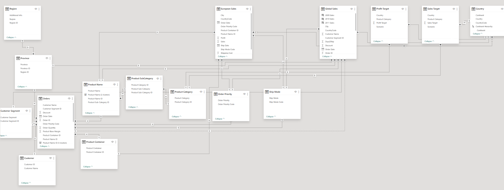  
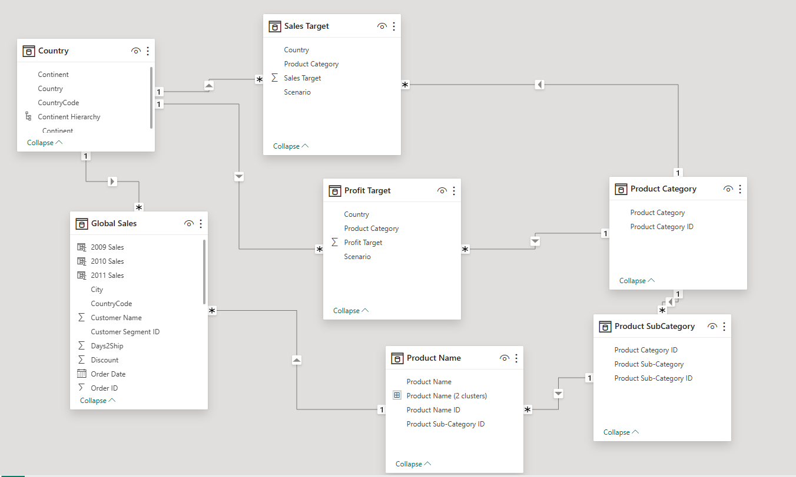

---

## 📌 Key Visuals & Dashboards

### 📍 Cluster Analysis
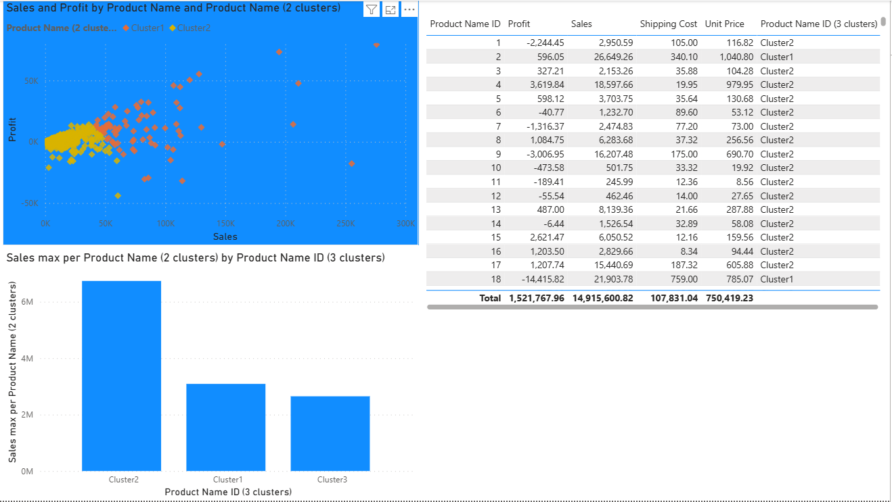

### 🌍 Regional Sales & Profit Visuals
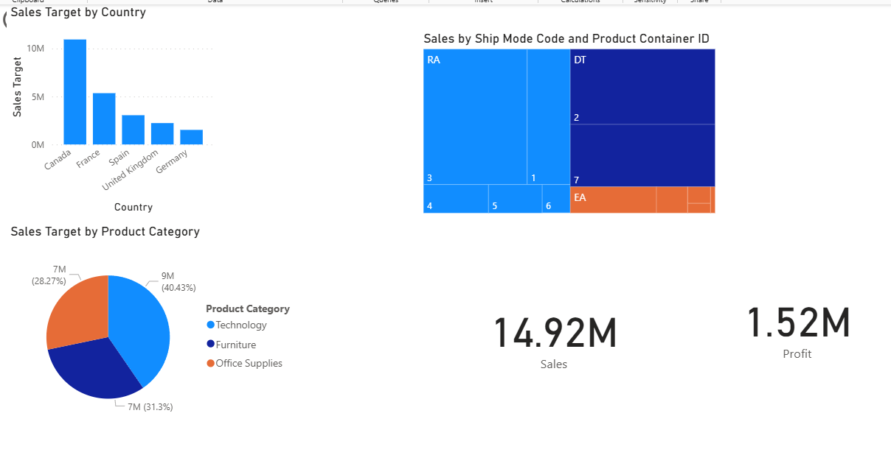  
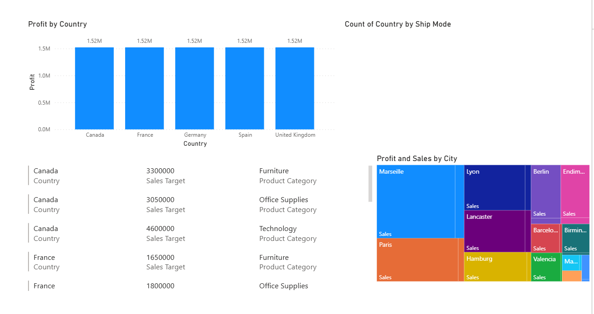  
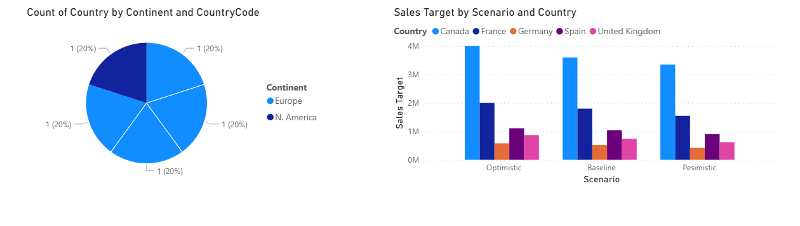

### 🌀 Animated Scatter Plot
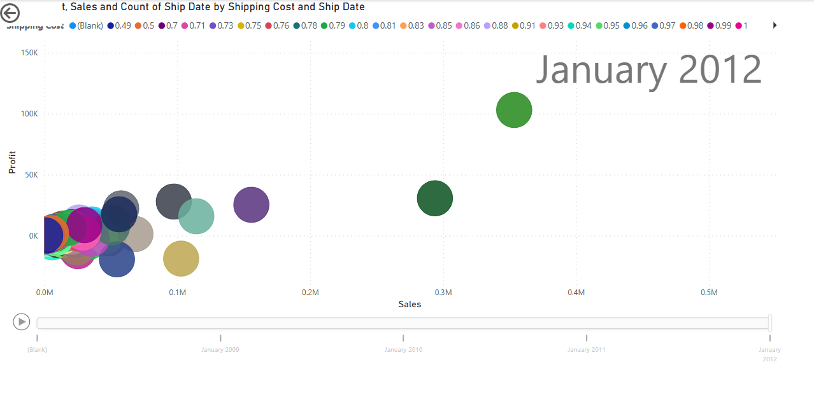  
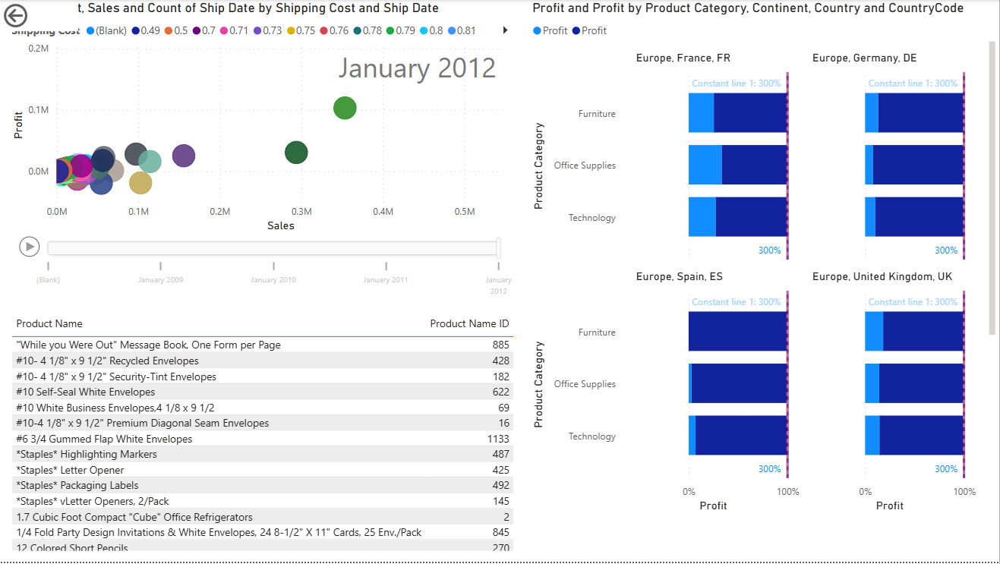

### 🧮 Category-Based Comparison
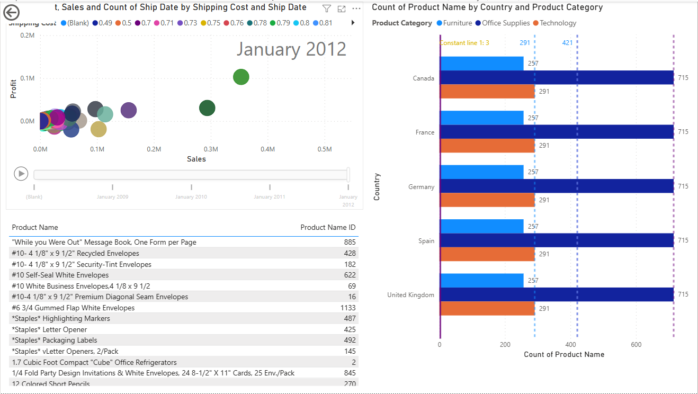

---

## 📈 Trend & Time Analysis

### Line Chart Trends
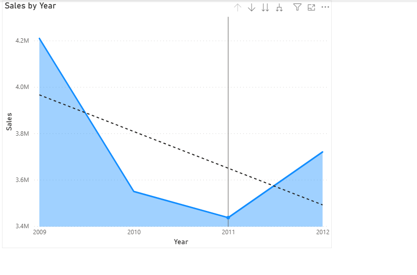  
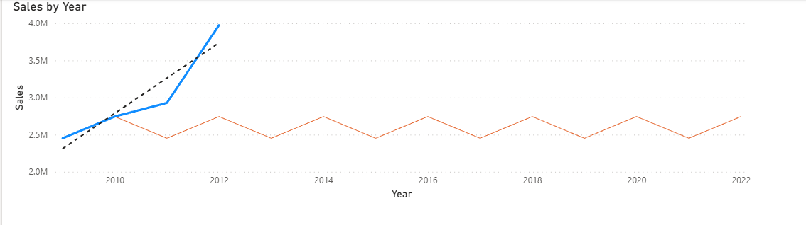

### 2009 vs 2011 Comparison

---

## 🔬 Detailed Cluster Visuals

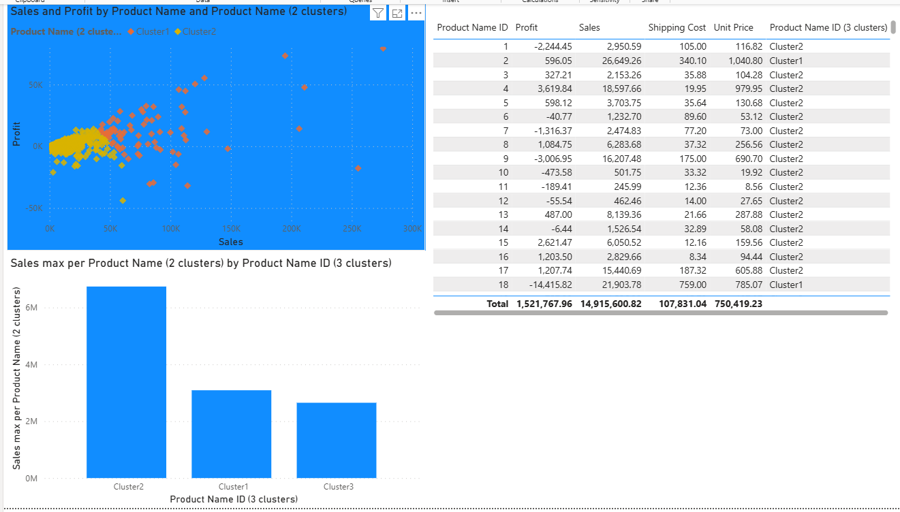

---

## 📄 License

This project is licensed under the **MIT License**.  
See the [LICENSE](LICENSE) file for full details.

---

## 👤 Author

> Built with 💡 and 📊 by [mischa24](https://github.com/mischa24)
